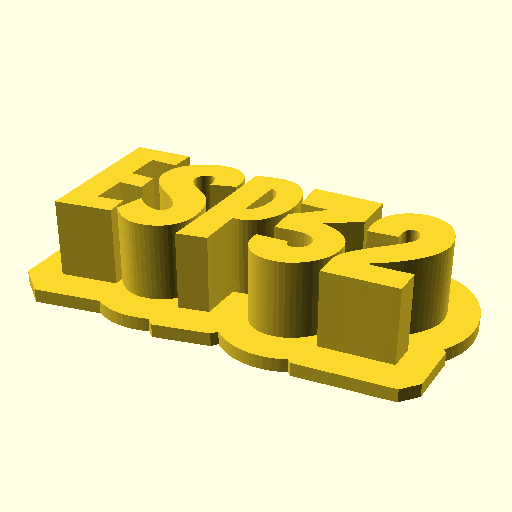

# `flat_text.scad`

Create a flat, extruded text plate, optionally with a holder for display. Good
for displaying finished, or in progress, projects.

## Requirements

- openscad
- BSD make (optional, not GNU make)
- X server (optional)

## Examples





## Usage

```console
openscad --render -o flat_text.stl -D flat_text_font='"Bangers"' -D flat_text_1='"Default text 1"' -D flat_text_2='"Default text 2"'
```

Or use bundled `Makefile`.

```console
make FLAT_TEXT_1="ESP32" FLAT_TEXT_2="WiFi + Bluetooth"
```

Use quoted _quotes_ to remove the second line.


```console
make FLAT_TEXT_1="ESP32" FLAT_TEXT_2="''" FLAT_TEXT_FLAGS="-D flat_text_size=10"
```

## Tips

PLA works fine.

Infill 20%. It rarely matters.

0.1 mm layer hight is recommended.

Sand the text surface with 150 sandpaper for better finish.

Use a sharp pinset and a toothbrush to remove oozed strings inside the text.

The bundled Bangers font is recommended (bold and clear). Change
`flat_text_base_offset_factor` when using other fonts.

## Authors

- [Tomoyuki Sakurai](https://github.com/trombik) (everything other than the
  bundled font)
- The Bangers Project Authors (Bangers font)

## License

ISC. See [LICENSE](LICENSE) for details. The bundled Bangers font is licensed
under Open Font License version 1.1. See [OFL.txt](fonts/Bangers/OFL.txt) for
details.
