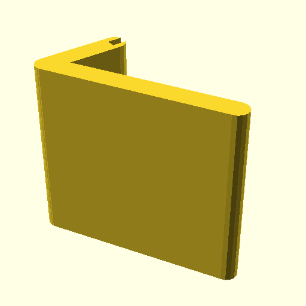

# `openscad-flat-text`

## Examples




## Usage

```console
make FLAT_TEXT_1="ESP32" FLAT_TEXT_2="WiFi + Bluetooth"
```

```console
make FLAT_TEXT_1="ESP32" FLAT_TEXT_2="''" FLAT_TEXT_FLAGS="-D flat_text_size=10"
```

```console
openscad --render -o holder.stl holder.scad
```
